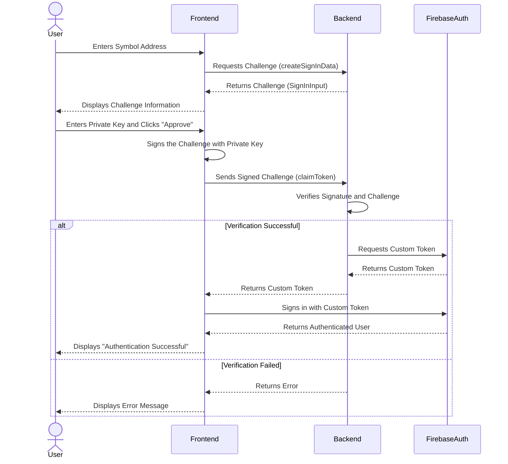

# **PROTOTYPE** Sign-in with Symbol

This is a demonstration of an authentication mechanism using a Symbol blockchain account. This method is based on the concept of "Sign-In with X," which is similar to "Sign-In with Ethereum."

## Authentication Flow

The authentication process is designed to verify ownership of a Symbol account without requiring a transaction on the blockchain. This is achieved by having the user sign a server-provided challenge message with their private key. The server then verifies this signature.

Here is the sequence diagram of the authentication flow:

### Steps

1.  **Challenge Request**:
    *   The user enters their Symbol account address on the frontend.
    *   The frontend sends the address to the backend and requests a challenge message (`createSignInData` function).
    *   The backend generates a unique, single-use challenge (`SignInInput`) containing a `nonce` and a timestamp, and stores its hash. It then sends the `SignInInput` object back to the frontend.

2.  **Client-Side Signing**:
    *   The frontend displays the details of the challenge to the user.
    *   The user confirms the details and enters their private key to approve the sign-in request.
    *   The frontend signs the `SignInInput` object (as a JSON string) with the user's private key.

3.  **Verification and Token Issuance**:
    *   The frontend sends the original `SignInInput` and the generated signature (`SignInOutput`) to the backend (`claimToken` function).
    *   The backend performs several verification steps:
        *   **Challenge Integrity**: It verifies that the received `SignInInput` matches the hash stored earlier.
        *   **Timestamp/Nonce**: It checks if the challenge is within the valid time window and hasn't been used before.
        *   **Domain/Address**: It verifies that the request domain and Symbol address are correct.
        *   **Signature**: It uses the public key from the `SignInOutput` to verify that the signature was created by the legitimate owner of the account.
    *   If all verifications pass, the backend requests a custom authentication token from Firebase Authentication.
    *   The backend returns this custom token to the frontend.

4.  **Firebase Authentication**:
    *   The frontend uses the custom token to sign in to Firebase (`signInWithCustomToken`).
    *   Firebase authenticates the user and returns a standard Firebase user object, completing the sign-in process.

